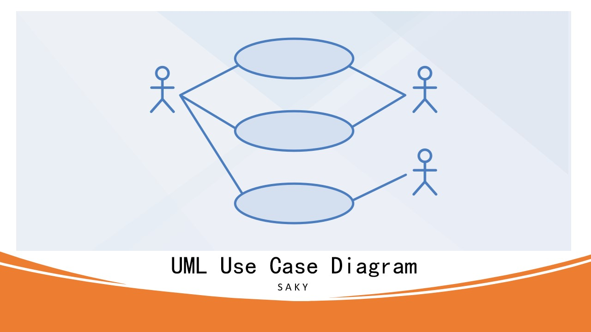
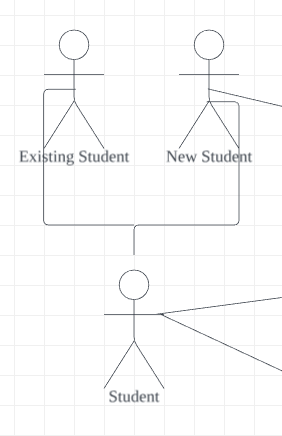

### UML (Unified Modeling Language)

UML, or Unified Modeling Language, is a standardized modeling language used in software engineering to visualize the design of a system. It provides a set of graphical notation techniques to create abstract models of specific systems, such as conceptual, specification, and implementation models. UML is not a programming language but tools can be used to generate code in various languages using UML diagrams.

### Use-Case Modeling
- Use-case modeling views the system as a closed entity defined by its response to external inputs.
- Use-case descriptions are commonly presented in plain text, with UML's stick figure notation being a prevalent method.
- Comprehensive understanding requires both textual and visual representations of use-cases.
- A use-case model encapsulates the system's functionality from a use-case perspective, often composed of multiple diagrams.
- A use-case diagram visually depicts the system, actors, use-cases, and their interconnections.

### Components of Use-Case Model

1. **Actors**: Entities that interact with the system. Someone or something that uses our system to acheive a goal.Actors are need to be placed outside the system as they are the external objects.
    * Person
    * Organization
    * Another System
    * An external device

2. **Use Cases**: Specific ways that actors interact with the system. Each use case represents a specific functionality of the system from the actor's perspective. It performs the tasks within the system. Should be started with verbs.

3. **Relationships**: Connections between actors and use cases, or between different use cases. They represent the interactions and dependencies between different parts of the system.

- **Association Relationships:** A relationship between an actor and a use case. It represents the communication between the actor and the use case.
- **Generalization Relationships:** A relationship between two use cases. It represents the inheritance between the two use cases.

    

- **Include Relationships:** A relationship between two use cases. It represents the inclusion of one use case in another use case.
- **Extend Relationships:** A relationship between two use cases. It represents the extension of one use case by another use case.
    
    *Photo Courtesy*: Lucid Software-YouTube Channel

4. **System Boundary**: The scope of the system being modeled. It defines what is inside the system (i.e., the use cases) and what is outside the system (i.e., the actors).
    * Website
    * Software component
    * Business process
    * App

### Creating Use-Case Diagrams
- Lucid: [Lucid](https://lucid.app/documents#/documents?folder_id=recent)
- Drawio: [Draw.io](https://app.diagrams.net/)
- Adding an extension of drawio to the VS Code and naming the projects with the extesion ".drawio". It will open the drawio editor in the VS Code itself.

### Watch the Tutorial

[Everything You need to know about UML Use Case Diagrams](https://youtu.be/zzgQ1UvDjV0)

**Happy Journey!**